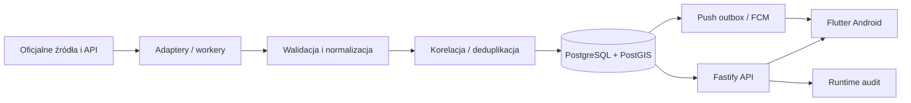

# Bezpieczna Polska

<p align="center">
  
</p>

<p align="center">
  <strong>Cywilna świadomość sytuacyjna w jednym miejscu.</strong><br>
  Oficjalne komunikaty, status kraju i okolicy, mapa zagrożeń, schronienia, stopnie alarmowe, dane PAA, Ukraina, NEPTUN i powiadomienia.
</p>

> [!IMPORTANT]
> **Bezpieczna Polska nie jest państwowym systemem alarmowym i nie zastępuje Alert RCB, numeru 112 ani komunikatów właściwych służb.**
> Brak wpisu w aplikacji nie oznacza braku zagrożenia. Aplikacja pokazuje to, co wynika z monitorowanych źródeł, wraz ze świeżością i pochodzeniem danych.

## Status projektu

**Status: aktywna alpha / przygotowanie do zamkniętej bety Android.**

Android jest obecnie platformą priorytetową. Backend produkcyjny działa na Railway, jest połączony z PostgreSQL/PostGIS i śledzi gałąź `main`.

Aktualny kod rozwojowy: **0.1.0-alpha.59** (`build 60`).

Najnowsze publiczne APK Android: [GitHub Releases — latest](https://github.com/mmaatteusz/bezpieczna-polska/releases/latest).

Publiczny Release może mieć niższy numer niż kod na `main`. Numer alpha i build są automatycznie podbijane po zmianach na `main`, natomiast Release powstaje dopiero po przejściu kontroli CI i podpisaniu właściwego APK.

## Najważniejsze funkcje

### Start

Ekran główny ma pokazywać najważniejsze informacje bez zalewania użytkownika komunikatami:

- status Polski i wybranej okolicy,
- najważniejsze aktywne zagrożenia,
- stopnie alarmowe RP i CRP,
- jawny stan świeżości danych,
- szybkie przejście do szczegółów, mapy i Alert Center.

Stopnie alarmowe są prezentowane osobno od oceny bieżącego zagrożenia. **BRAVO / BRAVO-CRP nie jest automatycznie traktowane jako bezpośrednie zagrożenie dla mieszkańca.**

### Alert Center i deduplikacja

Alerty z różnych obszarów i źródeł są normalizowane, korelowane i deduplikowane.

Jeżeli kilka komunikatów opisuje to samo zagrożenie, użytkownik nie dostaje sześciu identycznych kart. Interfejs pokazuje jedną kartę i jasno opisuje wynik, np.:

```text
SCALONO 6 KOMUNIKATÓW → 1 ZAGROŻENIE
```

Dzięki temu liczba dokumentów źródłowych nie jest mylona z liczbą niezależnych zagrożeń.

Dostępne są m.in.:

- filtrowanie i wyszukiwanie,
- podział według regionów i typów zdarzeń,
- informacja o źródle i weryfikacji,
- status aktywności i ważności,
- historia zmian / timeline,
- powiązane komunikaty i liczba niezależnych rodzin źródeł.

### Mapa Polski

Mapa wykorzystuje MapLibre i OpenFreeMap. Obsługuje m.in.:

- aktywne zdarzenia,
- granice województw,
- alerty RCB / zdarzenia bezpieczeństwa,
- IMGW,
- schronienia,
- PAA,
- lokalizację użytkownika,
- powrót do wybranej miejscowości,
- warstwy włączane i wyłączane z poziomu UI.

Legenda mapy rozróżnia podstawowe warstwy kolorami:

- **czerwony** — alerty / zdarzenia,
- **niebieski** — IMGW,
- **zielony** — schronienia,
- **fioletowy** — PAA.

Kliknięcie obiektu na mapie otwiera jego szczegóły zamiast pozostawiać użytkownika z samym znacznikiem.

### Zakłócenia GPS / GNSS

Warstwa GPSJAM jest dostępna jako osobna opcja pod mapą. Pokazuje dobowe, zagregowane obszary obniżonej dokładności nawigacji zgłaszanej przez samoloty.

Aplikacja **nie interpretuje tych danych jako dowodu celowego zagłuszania**.

### Schronienia

Obsługiwane są dane schronień / punktów schronienia z oficjalnych danych PSP / dane.gov.pl:

- mapa,
- wyszukiwanie,
- najbliższy punkt,
- zapytania przestrzenne PostGIS,
- pakiety offline,
- przejście do zewnętrznej nawigacji.

### PAA

PAA jest rozdzielone na dwa typy danych:

1. **komunikaty PAA** — mogą być prezentowane jako informacje / alerty,
2. **sieć pomiarowa** — dane referencyjne i pomiarowe wyświetlane na mapie.

Pomiar stacji **nie tworzy automatycznie alarmu i nie odwołuje komunikatu alarmowego**.

### NEPTUN

NEPTUN jest oddzielnym modułem świadomości sytuacyjnej dla Ukrainy.

Aplikacja:

- pokazuje bieżące wpisy live,
- rozróżnia typy zagrożeń, m.in. BSP/dron, FPV, rakieta, zagrożenie balistyczne, KAB i MiG-31K,
- używa czytelnych symboli typów zagrożeń na mapie,
- pozwala otworzyć szczegóły wpisu po dotknięciu symbolu,
- publikuje wyłącznie **celowo zgrubne pozycje**,
- nie pokazuje kursu, prędkości ani przewidywanej trasy,
- trzyma historię oddzielnie od danych live.

NEPTUN jest źródłem informacyjnym i **nie zastępuje oficjalnych alarmów**.

### UkraineAlarm

Integracja z oficjalnym UkraineAlarm API v3 działa po stronie backendu:

- sekret API pozostaje wyłącznie na serwerze,
- worker wykonuje synchronizację co około 90 s,
- główny live contract opiera się na `GET /api/v3/alerts`,
- stan źródła ma własny health/freshness,
- awaria UkraineAlarm **nie wpływa na Status Polski**.

### Powiadomienia i GPS — pierwsze uruchomienie

Na pierwszym uruchomieniu aplikacja pyta systemowo o:

1. **zgodę na powiadomienia**,
2. **dostęp do lokalizacji**.

Sekwencja jest zapamiętywana lokalnie i nie jest wyświetlana przy każdym wejściu do aplikacji.

Samo włączenie kategorii powiadomień wewnątrz aplikacji nie wystarcza — Android musi również udzielić zgody systemowej.

Backend produkcyjny ma skonfigurowane wymagane elementy Android FCM, w tym szyfrowanie tokenów i konto usługi FCM. Pełny test end-to-end dostarczenia push pozostaje częścią release gate. iOS / APNs nie blokuje obecnego rozwoju Androida.

## Źródła danych

Stan i kompletność źródeł są traktowane jawnie. `HEALTHY` oznacza poprawny ostatni cykl adaptera, **nie pełną wiedzę o wszystkich zdarzeniach w kraju**.

| Źródło / moduł | Stan | Rola |
|---|---:|---|
| RCB | ✅ | oficjalne komunikaty i status |
| RSO | ✅ | oficjalny eksport komunikatów |
| WCZK | 🟡 | rejestr 16 centrów, część integracji bezpośrednich; deduplikacja z RSO/RCB |
| Stopnie alarmowe RP / CRP | ✅ | osobny panel na ekranie Start i szczegóły z RCB |
| IMGW meteo | ✅ | oficjalne aktywne ostrzeżenia |
| IMGW hydro | ✅ | oficjalne aktywne ostrzeżenia hydrologiczne |
| PAA — komunikaty | ✅ | oficjalne informacje |
| PAA — sieć pomiarowa | ✅ | warstwa referencyjno-pomiarowa |
| CERT Polska | ✅ | oficjalne komunikaty bezpieczeństwa |
| CSIRT GOV | ⛔ | brak użytecznego bieżącego publicznego feedu — jawnie NOT_CONFIGURED |
| Straż Graniczna | ✅ | filtrowane oficjalne publikacje operacyjne |
| Policja | ✅ | oficjalny RSS z konserwatywnym filtrem |
| PSP — publikacje istotnych zdarzeń | ✅ | oficjalne publikacje z filtrem |
| Schronienia | ✅ | PostGIS, mapa, nearest, offline |
| NEPTUN | ✅ | osobna warstwa sytuacyjna, zgrubna geometria |
| UkraineAlarm API v3 | ✅ | osobna warstwa sytuacyjna Ukrainy |
| GPSJAM | ✅ | kontekstowa warstwa zakłóceń GPS/GNSS |
| Push Android / FCM | 🟡 | infrastruktura skonfigurowana; E2E jest elementem release gate |

Szczegółowy rejestr, semantyka pustych odpowiedzi i ograniczenia adapterów: [docs/SOURCES.md](docs/SOURCES.md).

## Semantyka jakości danych

Każde źródło ma dwie niezależne cechy:

- `sourceClass`: `STATUS`, `CONTEXT`, `REFERENCE` albo `SITUATIONAL`,
- `absenceSemantics`: `AUTHORITATIVE_EMPTY_SET` albo `NOT_PROVABLE`.

To rozróżnienie jest istotne:

- w niektórych oficjalnych API poprawny pusty wynik rzeczywiście oznacza brak aktywnych ostrzeżeń danego typu,
- w przypadku list publikacji brak nowego artykułu **nie dowodzi braku zagrożenia**,
- źródła kontekstowe i sytuacyjne nie mogą przypadkowo zmienić głównego Statusu Polski.

Aplikacja rozróżnia również:

- pochodzenie informacji,
- poziom weryfikacji,
- cykl życia,
- aktualność,
- rzeczywiste zdarzenie / ćwiczenie / test.

## Offline i odporność

Projekt korzysta z zasady **LAST KNOWN GOOD**:

- ostatnia poprawna kopia danych jest zachowywana,
- awaria źródła nie kasuje automatycznie poprzedniej informacji,
- stare dane są jawnie oznaczane jako `STALE`,
- brak połączenia nie jest zamieniany na fałszywy zielony status,
- pakiety danych regionów mogą działać offline.

## Architektura



### Mobile

- Flutter / Dart,
- MapLibre,
- SharedPreferences + bezpieczny magazyn sekretów,
- geolokalizacja i geokodowanie,
- Firebase Messaging,
- cache oraz pakiety offline,
- Android jako platforma priorytetowa.

### Backend

- Node.js 24,
- TypeScript,
- Fastify,
- PostgreSQL + PostGIS 17,
- workery źródeł,
- historia rewizji i incydentów,
- korelacja / deduplikacja,
- source health,
- outbox powiadomień,
- rate limiting,
- endpointy health/readiness,
- runtime audit po wdrożeniach.

## Railway

Stan produkcji zweryfikowany **28.09.2026**:

- projekt: `Bezpieczna Polska`,
- środowisko: `production`,
- główna usługa: `api`,
- backend śledzi `main`,
- root backendu: `/backend`,
- healthcheck: `/ready`,
- aktywna baza: PostgreSQL / PostGIS 17,
- ostatni deployment `api`: **SUCCESS**.

Publiczny backend:

```text
https://api-production-b6560.up.railway.app
```

Zmiany dotyczące wyłącznie aplikacji mobilnej nie muszą powodować nowego deploymentu backendu.

Historyczne zasoby Railway z wcześniejszych etapów alpha są opisane w runbooku i powinny zostać usunięte dopiero po potwierdzeniu backupów i zależności.

## Najważniejsze endpointy API

```text
GET  /health
GET  /ready
GET  /status?regionId=04
GET  /v1/snapshot?regionId=04
GET  /v1/sources
GET  /v1/map/layers
GET  /v1/layers/events.geojson
GET  /v1/shelters
GET  /v1/map/shelters
POST /v1/shelters/nearest
POST /v1/around
GET  /v1/radiation
GET  /v1/ukraine
GET  /v1/neptun
GET  /v1/layers/neptun.geojson
GET  /v1/events/:id/timeline
GET  /v1/incidents/:id/timeline
GET  /v1/incidents/:id/history
```

## Android: pakiety, podpis i aktualizacje

Projekt rozdziela linie instalacyjne:

```text
development: pl.bezpiecznapolska.dev
preview:     pl.bezpiecznapolska.preview
production:  pl.bezpiecznapolska
```

Dzięki temu lokalny debug nie może przypadkowo zepsuć podpisu preview lub produkcji.

Preview używa:

- stałego signera,
- monotonicznego `versionCode`,
- automatycznej kontroli certyfikatu,
- testu aktualizacji APK „na siebie”.

CI sprawdza prawdziwy scenariusz Android PackageManager:

1. instalacja starszego APK,
2. zapis danych aplikacji,
3. `adb install -r` nowszej wersji,
4. potwierdzenie zachowania danych,
5. potwierdzenie poprawnego `versionCode`,
6. potwierdzenie odrzucenia downgrade.

Finalny production keystore jest osobną tożsamością i **nie może trafić do repozytorium**.

## Automatyczne wersjonowanie

Po zmianie na `main` workflow wersjonujący podbija:

- `0.1.0-alpha.N`,
- build number Fluttera,
- wersję backendu,
- dokumentację wersji.

Automatyczny bump nie jest równoznaczny z opublikowaniem Release. Dystrybuowalne APK przechodzą osobny gate.

## CI i walidacja

Backend:

- TypeScript build,
- testy,
- PostgreSQL + PostGIS,
- migracje i idempotencja,
- persistence / restart,
- backup / restore smoke,
- audit zależności.

Flutter:

- `flutter pub get`,
- format check,
- `flutter analyze`,
- `flutter test`,
- testy map, alertów, offline, push i NEPTUN.

Runtime production:

- `/health`,
- `/ready`,
- source health,
- snapshot i status,
- map layers,
- schronienia,
- PAA,
- UkraineAlarm,
- NEPTUN,
- zgodność wdrożonego SHA.

Więcej: [docs/VALIDATION.md](docs/VALIDATION.md).

## Uruchomienie lokalne

### Backend

Wymagany Node.js 24+.

```bash
cd backend
npm ci
npm run build
npm test
npm start
```

### Flutter

```bash
cd mobile
flutter pub get
flutter analyze
flutter test
flutter run
```

Lokalny build Androida używa pakietu developerskiego. Dystrybuowalne preview należy budować przez GitHub Actions, aby zachować prawidłowy signer i ciągłość `versionCode`.

## Struktura repozytorium

```text
bezpieczna-polska/
├── backend/                 # Fastify, workery, adaptery, PostGIS
├── mobile/                  # Flutter / Android
├── docs/                    # architektura, źródła, audyty, runbook
├── scripts/                 # release/signing/utility scripts
└── .github/workflows/       # CI, release, runtime audit
```

## Co pozostało przed stabilnym wydaniem

Najważniejsze elementy przed publicznym wydaniem produkcyjnym:

1. pełny test end-to-end Android push na rzeczywistych urządzeniach,
2. finalizacja production signing i pierwszego production AAB/APK,
3. Google Play Internal Test,
4. polityka prywatności i formularz Google Play Data Safety,
5. dalsze testy aktualizacji „na siebie” między kolejnymi wydaniami,
6. audyt świeżości i zachowania wszystkich źródeł przy awarii,
7. porządki historycznych usług Railway po backupie,
8. dopracowanie pakietów offline i mapy,
9. iOS / APNs dopiero po ustabilizowaniu Androida,
10. później: panel administracyjny i dodatkowe narzędzia operatorskie.

## Dokumentacja

- [Roadmap](docs/ROADMAP.md)
- [Audyt projektu](docs/AUDIT_2026-09-26.md)
- [Architektura](docs/ARCHITECTURE.md)
- [Rejestr źródeł](docs/SOURCES.md)
- [Runbook produkcyjny](docs/PRODUCTION_RUNBOOK.md)
- [Walidacja i CI](docs/VALIDATION.md)

Dokumenty etapów w `docs/` zachowują historię decyzji technicznych. README opisuje bieżący obraz projektu, natomiast szczegóły kontraktów należy sprawdzać w aktualnych dokumentach źródłowych i kodzie.

## Zasady projektu

1. **Brak danych ≠ bezpieczeństwo.**
2. **Brak wpisu w źródle częściowym ≠ brak zagrożenia.**
3. Oficjalne źródła, agregatory i źródła sytuacyjne zachowują odrębną tożsamość.
4. Nie zgadujemy geometrii, kompletności źródła ani czasu zakończenia zdarzenia.
5. `STALE`, `BROKEN` i `NOT_CONFIGURED` mają być widoczne, a nie ukrywane.
6. Kilka dokumentów o jednym zdarzeniu nie może udawać kilku niezależnych zagrożeń.
7. Stopnie alarmowe RP nie są automatycznie alarmem dla ludności.
8. NEPTUN i UkraineAlarm nie wpływają na Status Polski.
9. Pomiary PAA nie są automatycznie alarmem.
10. Sekrety API, tokeny, klucze Firebase/APNs, keystore i dane uwierzytelniające nie trafiają do repozytorium.

---

Projekt jest rozwijany iteracyjnie. Priorytetem jest **czytelność informacji, odporność na awarie źródeł i brak fałszywego poczucia bezpieczeństwa**, a nie liczba integracji za wszelką cenę.
