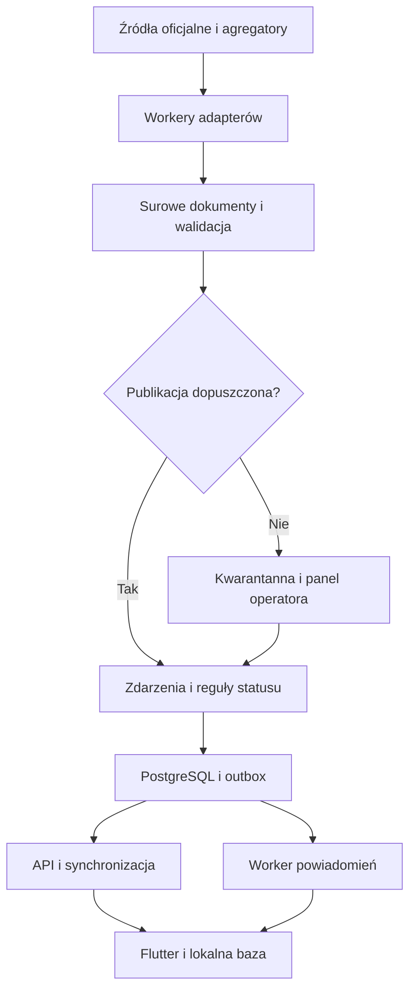

# Bezpieczna Polska — projekt techniczny i plan realizacji

Wersja 0.1 • aktualizacja 21 września 2026 • Dokument architektury. Rdzeń aplikacji działa, a pozostałe sekcje opisują stan docelowy i kolejne etapy.

Podstawa: wymagania przekazane przez Mateusza, punkty 1–79. Punkt 79 urywa się w dostarczonym tekście. Przyjęta reguła: trzy relacje nie stanowią automatycznie trzech niezależnych potwierdzeń. Nie dopisano nieznanych dalszych wymagań.

## 1. Decyzja produktowa

Budujemy cywilny serwis informacji o bezpieczeństwie, z aplikacjami Android/iOS, backendem agregującym oficjalne komunikaty i panelem operatora. Jego zadaniem jest pokazać: co wiadomo, na jakim obszarze, od kiedy, z jakiego źródła, czy informacja nadal obowiązuje i jakie działania zaleca właściwy organ.

Nie deklarujemy pełnej obserwacji zagrożeń ani gwarantowanego doręczenia ostrzeżeń. Aplikacja uzupełnia kanały państwowe. Taki zakres musi wynikać z rzeczywistego działania produktu, nie tylko z regulaminu.

Najważniejsza zmiana względem briefu: zielony status oznacza **„Brak aktywnych ostrzeżeń w monitorowanych źródłach”**, a nie „jest bezpiecznie”. Nieobecność wpisu w serwisie informacyjnym nie dowodzi nieobecności zagrożenia.

Pierwsze wydanie realizuje zakres MVP w etapach 0.1 i 1.0. Nie usuwamy z docelowej wersji RSO, WCZK, SG, PAA, CERT, Ukrainy ani schronienia. Najpierw budujemy jeden kompletny przepływ, następnie dokładamy zweryfikowane integracje. Nie oznaczamy niedostępnych adapterów jako działających.

## 2. Korekty modelu domenowego

### 2.1. Cztery niezależne osie

| Oś | Wartości | Znaczenie |
|---|---|---|
| Pochodzenie | OFFICIAL_PL, OFFICIAL_FOREIGN, AGGREGATOR, OSINT | Kto opublikował informację |
| Weryfikacja twierdzenia | CONFIRMED, PROBABLE, UNVERIFIED, REFUTED, DISPUTED | Jakie dowody mamy na konkretne twierdzenie |
| Cykl życia | SCHEDULED, ACTIVE, ENDED, CANCELLED, EXPIRED, UNKNOWN | Czy komunikat lub zdarzenie nadal obowiązuje |
| Aktualność | FRESH, STALE, UNKNOWN | Czy dysponujemy aktualnymi danymi |

Karta może jednocześnie pokazywać „OFICJALNE • ZAKOŃCZONE”. Oficjalne dementi pozostaje oficjalnym komunikatem, choć opisane w nim pierwotne twierdzenie jest fałszywe. Słowa „potwierdzono zdarzenie” nie można rozciągać na niepotwierdzone przyczyny, liczbę ofiar czy sprawcę.

`sourceTier` należy przede wszystkim do źródła, a nie całego wydarzenia. Jedno wydarzenie może mieć komunikat PSP i trzy relacje OSINT. Przy każdym fakcie zachowujemy jego pochodzenie. W przyszłej korelacji liczba niezależnych źródeł wynika z genealogii relacji, a nie liczby adresów URL.

### 2.2. Rzeczywistość, testy i ćwiczenia

Każdy komunikat ma `messageContext = ACTUAL | EXERCISE | TEST | UNKNOWN`.

Ćwiczenia i testy nie podnoszą rzeczywistego poziomu zagrożenia, nawet jeżeli pochodzą z RCB. Mogą generować spokojne powiadomienie „Dziś ćwiczenia syren w Twoim regionie”. Niejednoznaczny kontekst trafia do weryfikacji; nie staje się automatycznie alertem krytycznym.

### 2.3. Kanał i rodzaj zagrożenia

RCB, RSO i WCZK są kanałami/instytucjami, a pożar, ewakuacja, zagrożenie powietrzne i skażenie są typami zdarzeń. Nie tworzymy jednego enumu mieszającego oba pojęcia. Zakładka RCB filtruje źródła, warstwa „pożary” filtruje typy. Ten sam obiekt może być widoczny w obu miejscach bez tworzenia dwóch incydentów.

### 2.4. Oddzielenie obserwacji od decyzji

Oryginalny komunikat to niezmienny dokument źródłowy. Wydarzenie jest wersjonowaną interpretacją dokumentów. Status regionu jest wynikiem wersjonowanej reguły. Każdy z tych poziomów ma osobny czas, identyfikator i historię.

## 3. Status Polski i okolicy

### 3.1. Dwie wartości zamiast jednego koloru

Status zwraca `hazardLevel` i `coverageState` niezależnie:

- `hazardLevel`: NO_ACTIVE_WARNINGS, CAUTION, ACTIVE_DANGER, UNKNOWN.
- `coverageState`: COMPLETE_FOR_CONFIGURED_SCOPE, PARTIAL, STALE, UNAVAILABLE.

„Kompletne” dotyczy wyłącznie skonfigurowanego zakresu źródeł i kategorii. Nie oznacza kompletnej wiedzy o świecie. Ekran pokazuje kategorie jeszcze nieobsługiwane; nie rysuje ich na zielono.

### 3.2. Kolejność reguł

| Warunek | Wynik |
|---|---|
| Ważny, rzeczywisty komunikat właściwego oficjalnego organu o bezpośrednim zagrożeniu dla badanego obszaru | ACTIVE_DANGER + uzasadnienie |
| Istotne aktywne ostrzeżenie, bez przesłanek bezpośredniego zagrożenia | CAUTION |
| Brak takich komunikatów, wymagane źródła sprawne i semantycznie aktualne | NO_ACTIVE_WARNINGS |
| Brak dostatecznie aktualnych danych i brak ważnego ostrzeżenia, które nadal można pokazać | UNKNOWN |
| Awaria źródła przy wcześniej trwającym zagrożeniu | Zachowaj ostatnie znane ostrzeżenie, oznacz STALE i „Nie potwierdzono zakończenia” |
| Termin komunikatu minął bez informacji o ustaniu zdarzenia | Komunikat EXPIRED; nie utożsamiaj z końcem zagrożenia |

Brak aktualizacji nie odwołuje alarmu. Jednocześnie nie utrzymujemy starego czerwonego komunikatu jako świeżego bez końca: po upływie ważności dominujący opis mówi „Aktualna sytuacja nieznana”, a poprzednie zagrożenie pozostaje widoczne jako ostatnia znana informacja.

Alert RCB nie oznacza automatycznie RED: może informować o ćwiczeniach, odwołaniu zakazu lub ostrożności. Wymagane są kontekst, rzeczywista treść, obszar i ważność. Priorytet źródła nie zastępuje oceny znaczenia komunikatu.

Stan alarmowy BRAVO/CHARLIE i stan CRP pokazujemy jako osobne, dokładnie przytoczone decyzje administracyjne. Sam BRAVO-CRP nie jest potwierdzeniem trwającego cyberataku ani przyczyną czerwonego ekranu.

### 3.3. Status kraju nie jest maksimum wszystkich lokalnych kolorów

Pożar w jednym powiecie może oznaczać czerwony status miejscowy. Karta Polski pokazuje wówczas „Aktywne zagrożenie lokalne — 1 obszar”, z odnośnikiem do mapy. Nie nazywa całej Polski obszarem bezpośredniego zagrożenia. Zagrożenie ogólnopolskie wymaga odpowiedniego zasięgu komunikatu lub wyraźnej decyzji właściwego organu.

Dla każdej kategorii zapisujemy: `reasonCodes`, `supportingEventIds`, `rulesetVersion`, `evaluatedAt`, `validUntil`, `lastEvidenceAt`, `coverage`. Użytkownik może otworzyć „Dlaczego taki status?”.

### 3.4. Model odpowiedzi statusu — przykład syntetyczny

```json
{
  "scope": {"kind": "REGION", "regionId": "demo-region"},
  "hazardLevel": "UNKNOWN",
  "coverageState": "PARTIAL",
  "displayText": "Brak aktualnych danych z części źródeł",
  "reasonCodes": ["REQUIRED_SOURCE_STALE"],
  "supportingEventIds": [],
  "rulesetVersion": "1.0.0",
  "evaluatedAt": "2026-09-17T21:00:00Z",
  "validUntil": "2026-09-17T21:02:00Z",
  "isDemo": true
}
```

Przykład nie opisuje rzeczywistej sytuacji bezpieczeństwa Polski.

## 4. Architektura

Rekomendacja: modularny monolit, osobne procesy API i workerów, jedna główna baza PostgreSQL/PostGIS. Nie zaczynamy od mikroserwisów ani Kafki.

| Element | Wybór projektowy | Odpowiedzialność |
|---|---|---|
| Mobile | Flutter + Dart | Android/iOS, dostępność, cache, mapy |
| Stan UI | Riverpod; router deklaratywny | Jawne stany ładowania, błędu, offline |
| Baza mobilna | SQLite, np. Drift | Zdarzenia, pakiety regionów, checkpoint synchronizacji |
| Backend | TypeScript, Node.js LTS, Fastify | API, walidacja, reguły, autoryzacja |
| Workery | Ten sam monorepozytorium, oddzielne procesy | Pobieranie, parsery, harmonogramy, push |
| Dane | Supabase PostgreSQL + PostGIS | Trwałość, geometrie, konta opcjonalne |
| Realtime | Supabase Realtime albo własny WebSocket | Informacja o nowej wersji danych |
| Push | FCM; na iOS dostarczanie przez APNs | Powiadomienia systemowe |
| Mapy | MapLibre + wybrany dostawca kafelków | Renderowanie i pakiety offline |
| Panel | React + TypeScript | Weryfikacja, korekty, stan źródeł |
| Obiekty | Prywatny storage + publiczne pakiety przez CDN | Surowe dokumenty, paczki offline |
| Kolejka | PostgreSQL outbox i worker na start | Odporne ponawianie i historia dostarczenia |
| Redis | Opcjonalny po pomiarach | Cache, limity, koordynacja pracy |

Wersje bibliotek należy przypiąć po próbie integracyjnej Flutter–MapLibre–offline i sprawdzeniu aktualnej kompatybilności. Wymienione biblioteki są decyzjami projektowymi, nie potwierdzeniem przeprowadzonego builda.



Supabase nie zastępuje procesu ingestion ani procedur operacyjnych. Długotrwałe pobieranie, parsery i ponawianie uruchamiamy w workerach. Realtime jest sygnałem odświeżenia, nie jedyną kopią komunikatu.

## 5. Pipeline i kontrakt adapterów

Zachowujemy wszystkie wymagane etapy: fetch, parse, normalize, verify, geolocate, deduplicate, healthCheck. Deduplikacja między źródłami jest jednak usługą wspólną. Adapter dostarcza klucze i wskazówki, a nie samodzielnie łączy wydarzenia w bazie.

```typescript
interface SourceAdapter {
  id: string;
  fetch(cursor?: string): Promise<FetchEnvelope>;
  parse(raw: FetchEnvelope): ParseResult;
  normalize(parsed: ParsedItem): NormalizedReport;
  verify(report: NormalizedReport): ValidationResult;
  geolocate(report: NormalizedReport): GeoResolution;
  deduplicate(report: NormalizedReport): DedupHints;
  healthCheck(result: AdapterRun): SourceHealth;
}
```

To kontrakt koncepcyjny; typy pomocnicze nie stanowią jeszcze biblioteki wykonawczej. `verify()` weryfikuje strukturę, domenę, daty, referencje i spójność. Nie jest automatycznym dowodem prawdziwości incydentu.

`FetchEnvelope` przechowuje URL, czas pobrania, status HTTP, content type, ETag/Last-Modified, hash bajtów, wersję parsera i referencję do prywatnego archiwum. Osobno liczymy hash treści merytorycznej: zmiana stopki nie jest aktualizacją alarmu.

Kolejność: pobranie → zapis dowodu → parsowanie → normalizacja → walidacja → lokalizacja → korelacja → reguły dowodów i znaczenia → transakcja zdarzenie + revision + outbox → publikacja i powiadomienie.

Retry z backoff i jitter, respektowanie Retry-After, timeout, limit rozmiaru dokumentu, ograniczenie współbieżności na domenę. Zakaz obchodzenia autoryzacji i blokad. Błąd pojedynczego źródła nie zatrzymuje innych.

### 5.1. Pusta odpowiedź

Rozróżniamy: poprawna lista bez aktywnych alertów, pusty HTML po zmianie szablonu, błąd autoryzacji, niepełną paginację i starą odpowiedź cache. Parser musi rozpoznać strukturę oraz jawny stan pusty. Samo `items.length == 0` nie kończy istniejących zdarzeń.

Pełny snapshot może być podstawą zakończenia wpisu tylko wtedy, gdy dokumentacja źródła definiuje taką semantykę, walidacja kompletności przeszła, a reguła ma test. Preferujemy jawne odwołanie albo udokumentowany czas zakończenia.

### 5.2. Monitorowanie

Obowiązkowo: lastAttempt, lastSuccess, lastFailure, consecutiveFailures, responseTime, lastItemTime, lastSemanticValidation, expectedCadence, contentFingerprint, status i powód. HTTP 200 nie oznacza sprawnego adaptera. Stary artykuł na spokojnym kanale nie oznacza awarii.

Stan zdrowia: HEALTHY, DEGRADED, STALE, BROKEN, DISABLED, NOT_CONFIGURED. Monitorujemy także kolejkę, opóźnienie przetwarzania, świeżość statusów i publikację paczek offline. Heartbeat workera trafia do monitora niezależnego od tego samego workera.

## 6. Rejestr źródeł — ustalenia i ograniczenia

Sprawdzenie wykonano 17.09.2026 przez odczyt publicznych stron i dokumentacji. Nie wykonywano autoryzowanych zapytań produkcyjnych, długotrwałych pomiarów ani testów wszystkich kanałów. **„Nie potwierdzono API” nie znaczy „API na pewno nie istnieje”.** Strona www, RSS, prywatny endpoint aplikacji i udokumentowane API partnerskie to różne rzeczy.

| Źródło | Co potwierdzono | Droga integracji | Co blokuje produkcję |
|---|---|---|---|
| RCB | Oficjalny serwis z komunikatami, również ćwiczeniami i odwołaniami | Backendowy parser stron komunikatów; API tylko po uzyskaniu dokumentacji | Pełność publikacji względem SMS, zasady czasu obowiązywania, test parsera |
| RSO | Oficjalny opis MSWiA wskazuje publikację przez TVP; strona listy dostępna | Adapter HTML lub uzgodniony feed | Nie potwierdzono publicznego kontraktu API |
| WCZK | RSO ma komunikaty wojewodów; sprawdzono portal kujawsko-pomorski | Najpierw RSO, następnie adaptery wojewódzkie | Indywidualna inwentaryzacja kanałów i geokodowania |
| Stopnie alarmowe | Oficjalna sekcja RCB | Dokument decyzji + parser dat i zakresu | Walidacja aktualnie obowiązujących dokumentów |
| SG | Oficjalna strona usługi RSS | RSS po ustaleniu konkretnego działającego feedu, HTML jako wariant | Payload feedu i regionalne kanały nieprzetestowane |
| CERT Polska | Strona i publiczne komunikaty moje.cert.pl | Parser komunikatów; RSS po potwierdzeniu adresu i formatu | Nie potwierdzono tu technicznego kontraktu RSS |
| PAA | Oficjalny portal odsyła do mapy pomiarów | Komunikaty PAA; pomiary dopiero po uzgodnieniu źródła danych | Nie potwierdzono publicznego API pomiarów ani warunków eksportu |
| Schronienie PSP | Do dalszej weryfikacji aktualny zbiór i kategorie | Oficjalny eksport/umowa/dataset z wersją | Nie pobrano i nie zweryfikowano zbioru; gdziesieukryc.pl zwróciło 403 w tym odczycie |
| alerts.in.ua | Publiczna dokumentacja API, token, limity i wymóg proxy | Udokumentowany endpoint przez backend | Token, akceptacja zasad, test danych i pochodzenia |
| DO RSZ | Oficjalny serwis i aktualności | Parser publicznych komunikatów cywilnych | API niepotwierdzone, dobór kanału i uprawnień do ponownej publikacji |
| IMGW | Portal danych publicznych i regulamin | Adapter konkretnych ostrzeżeń po weryfikacji formatu | Nie zakładamy działającego endpointu na podstawie dawnych przykładów |
| Policja, PSP, CSIRT GOV, GDDKiA | Kandydaci przewidziani w projekcie | Osobna kwalifikacja przed aktywacją | Nie objęto pełnym audytem technicznym w tym dokumencie |

Podstawy: [RCB](https://www.gov.pl/web/rcb), [RSO — opis MSWiA](https://www.gov.pl/web/mswia/regionalny-system-ostrzegania), [publiczna lista RSO](https://komunikaty.tvp.pl/komunikaty/wszystkie/wszystkie), [stopnie alarmowe RCB](https://www.gov.pl/web/rcb/stopnie-alarmowe2), [RSS SG](https://www.strazgraniczna.pl/pl/rss), [CERT](https://cert.pl/), [komunikaty CERT](https://moje.cert.pl/komunikaty/), [PAA](https://www.gov.pl/web/paa), [API alerts.in.ua](https://devs.alerts.in.ua/), [DO RSZ](https://www.wojsko-polskie.pl/dorsz/), [IMGW](https://danepubliczne.imgw.pl/), [urząd kujawsko-pomorski](https://www.gov.pl/web/uw-kujawsko-pomorski).

### 6.1. alerts.in.ua — rzeczywisty endpoint

Dokumentacja podaje `GET https://api.alerts.in.ua/v1/alerts/active.json`, z nagłówkiem `Authorization: Bearer <TOKEN>`. Opisuje limit miękki 8–10 zapytań/min/IP i twardy 12/min/IP. Projektujemy jeden centralny polling co 15–30 sekund, w ramach wspólnego budżetu zapytań dla wszystkich workerów i endpointów; retry też zużywa budżet.

Dostawca deklaruje czerpanie informacji ze źródeł oficjalnych, ale jest projektem wolontariackim. W modelu: dostawca AGGREGATOR; pochodzenie pierwotnego komunikatu odrębnie. Jeżeli API nie dostarcza weryfikowalnego źródła konkretnego rekordu, nie nadajemy mu etykiety bezpośredniego komunikatu urzędu. Dokumentacja ostrzega przed opóźnieniami i wyklucza używanie API dla infrastruktury krytycznej. Moduł Ukrainy ma charakter kontekstowy. [Dokumentacja dostawcy](https://devs.alerts.in.ua/).

### 6.2. Karta SOURCE.md dla każdego adaptera

Przy implementacji każdy poniższy identyfikator dostaje oddzielny `sources/<id>/SOURCE.md` według tej karty. Brak danych nie może być zastąpiony domysłem.

```yaml
id: RCB
name: Rządowe Centrum Bezpieczeństwa
owner: Rządowe Centrum Bezpieczeństwa
homepage: https://www.gov.pl/web/rcb
source_tier: 1
transport: HTML
api_documentation: null
api_status: NOT_CONFIRMED
feed_url: null
authentication: NONE_FOR_PUBLIC_PAGE
polling_proposal_seconds: 120
provider_rate_limit: NOT_CONFIRMED
license: VERIFY_PER_CONTENT_TYPE_AND_RECORD_TERMS
terms_url: RESOLVE_FROM_OFFICIAL_SITE
data_format: HTML_REQUIRES_FIXTURE
backup: RSO_WHERE_SAME_ISSUED_MESSAGE_IS_AVAILABLE
backup_independence: NOT_INDEPENDENT_IF_REPUBLICATION
format_change_risk: HIGH
verification_status: PUBLIC_PAGE_ONLY
last_checked: 2026-09-17
production_enabled: false
```

Parametry robocze, nie stwierdzenia o limitach dostawców:

| ID adaptera | Proponowany cykl | Autoryzacja / format | Backup i ryzyko |
|---|---|---|---|
| RCB | 120 s, szybszy po uzgodnieniu | Publiczny HTML | RSO/retransmisja; wysokie ryzyko zmian HTML |
| RSO | 120 s | Publiczny HTML; API niepotwierdzone | WCZK dla danego regionu; wysokie |
| WCZK_* | 180–300 s | Ustalić per województwo | RSO; wysokie |
| SECURITY_LEVELS | 15 min; częściej przy terminie końca | HTML + dokument decyzji | RCB/MSWiA/KPRM; wysokie ryzyko semantyczne |
| SG_CENTRAL, SG_* | 300 s | RSS po walidacji lub HTML | Centralny/regionalny komunikat; średnie–wysokie |
| CERT_PL | 300 s | Publiczny HTML, RSS do weryfikacji | Komunikat tego samego CERT w drugim kanale |
| PAA | 300 s dla komunikatów | HTML; pomiary jako osobny adapter | RCB dla wydanego ostrzeżenia; nie zastępuje pomiarów |
| PSP_SHELTERS | Kontrola wersji raz dziennie | Format i dostęp niepotwierdzone | Ostatnia podpisana paczka; ryzyko nieaktualności terenowej |
| UA_ALERTS | 15–30 s | Bearer token / JSON | Osobny dostawca dopiero po kwalifikacji |
| DORSZ | 120 s | Publiczny HTML | RCB; wysokie ryzyko niepełności kanału |
| IMGW_WARNINGS | Według kontraktu, roboczo 120 s | Do sprawdzenia | RSO, z zachowaniem źródła pierwotnego |

Dla wszystkich: licencja, warunki automatycznego pobierania i limit są niepotwierdzone, chyba że zostały wyraźnie udokumentowane powyżej. Widoczność publiczna nie jest równoznaczna z dowolnym prawem do redystrybucji. Osobno zapisujemy zasady tekstów, zdjęć, danych i map.

Adaptery WCZK: DOLNOSLASKIE, KUJAWSKO_POMORSKIE, LUBELSKIE, LUBUSKIE, LODZKIE, MALOPOLSKIE, MAZOWIECKIE, OPOLSKIE, PODKARPACKIE, PODLASKIE, POMORSKIE, SLASKIE, SWIETOKRZYSKIE, WARMINSKO_MAZURSKIE, WIELKOPOLSKIE, ZACHODNIOPOMORSKIE. Nie wpisujemy niezweryfikowanych adresów feedów. Pierwszy pilotaż: kujawsko-pomorskie; następnie regiony graniczne.

## 7. Baza danych

### 7.1. Tabele

| Grupa | Tabele i przeznaczenie |
|---|---|
| Źródła | sources, source_health, ingestion_runs, raw_documents |
| Komunikaty | source_reports, report_revisions, report_regions |
| Zdarzenia | events, event_sources, event_updates, event_regions |
| Dowody | claims, claim_evidence, source_lineage — pełniejsze użycie od OSINT |
| Kategorie | rcb_alerts, rso_alerts, security_levels, border_events, cyber_events, radiation_events |
| Przestrzeń | regions, region_versions, shelters, shelter_imports |
| Status | status_snapshots, rule_versions |
| Powiadomienia | notification_outbox, notification_deliveries, notification_preferences, device_tokens, subscriptions |
| Prywatność | user_locations — tylko dla jawnie włączonej synchronizacji; domyślnie lokalnie |
| Administracja | admin_actions, review_queue, event_aliases |
| Offline | offline_manifests, content_versions |

Tabele kategorii są rozszerzeniami wspólnego modelu albo widokami. Nie kopiują niezależnie tytułu, geometrii i statusu. `source_reports` ma unikalność `(source_id, external_id)`, a rewizja `(report_id, semantic_hash)`. Powiązanie raportu z wydarzeniem jest odwracalne i audytowane.

### 7.2. Event

Wymagane pola: id UUID, eventType, title, summary, severity, securityRelevance, lifecycle, verification, messageContext, geometry, geographicScope, startedAt, validFrom, validTo, endedAt, createdAt, updatedAt, revision, instructionsRefs, evidenceRefs, metadata.

Dodatkowo: geometryRole, geometryPrecision, geometrySource, locationResolutionStatus, closureReason, supersedesEventId, publicationState. Geometria może być pusta dla ogólnopolskiej kampanii phishingowej. `country/voivodeship/county/municipality` są projekcją relacji do regions, a nie czterema polami ograniczającymi zdarzenie do jednego powiatu.

`isOfficial`, `isVerified`, `sourceCount`, `isHistorical` wyliczamy z dowodów i stanu, nie pozwalamy klientowi ich ustawiać. `latitude/longitude` służą do wyświetlania punktu reprezentacyjnego, nie zastępują obszaru zagrożenia.

### 7.3. EventSource i historia

EventSource: id, eventId, reportRevisionId, sourceId, sourceNameSnapshot, sourceUrl, publishedAt, retrievedAt, rawContentHash, sourceTierSnapshot, evidenceRole, originSourceId, independenceGroupId.

EventUpdate: eventId, revision, changeType, effectiveAt, recordedAt, previousValue, newValue, reason, evidenceRefs, actorType, actorId. Kolejność nie zależy wyłącznie od godziny publikacji: spóźniony artykuł nie nadpisuje nowszego odwołania.

Czasy przechowujemy w UTC jako timestamptz. Interfejs pokazuje jednoznaczną lokalną godzinę i datę, z poprawną obsługą Europe/Warsaw i Europe/Kyiv. Zachowujemy oryginalną strefę źródła i informację o niepewnej dacie.

### 7.4. PostGIS

Przechowujemy geometry SRID 4326 i indeksowany wariant geography do metrów. Akceptujemy POINT, LINESTRING, POLYGON, MULTIPOLYGON; walidujemy typ, SRID, zakres współrzędnych i poprawność geometrii. Geometria obszaru oddziaływania jest osobna od miejsca zdarzenia. Nie wyznaczamy arbitralnego promienia skażenia z punktu pożaru.

Przykład projektowy dla tabeli `events` z kolumną `impact_geog geography(Geometry,4326)`:

```sql
CREATE INDEX events_impact_geog_gist
  ON events USING gist (impact_geog);

SELECT id, title, lifecycle, revision
FROM events
WHERE publication_state = 'PUBLISHED'
  AND lifecycle = 'ACTIVE'
  AND message_context = 'ACTUAL'
  AND impact_geog IS NOT NULL
  AND ST_DWithin(
    impact_geog,
    ST_SetSRID(ST_MakePoint($1, $2), 4326)::geography,
    $3
  );
```

Parametry: długość, szerokość, promień w metrach; backend ogranicza promień i wielkość wyniku. Używamy odległości od obszaru, nie jego środka. Komunikaty ogólnopolskie i nieprzestrzenne dołączamy osobną regułą zakresu, bo nie trafią do powyższego filtra. `ST_DWithin` dla geography przyjmuje metry i wspiera wykorzystanie indeksu przestrzennego. [PostGIS](https://postgis.net/docs/ST_DWithin.html).

## 8. Deduplikacja, wiarygodność i znaczenie

Poziom 1: identyczny identyfikator dokumentu — aktualizacja tego samego raportu. Poziom 2: identyczna treść i wskazanie źródła — retransmisja. Poziom 3: podobny typ, czas i obszar — kandydat na to samo wydarzenie.

Nie łączymy automatycznie dwóch pożarów w jednym mieście tylko dlatego, że wystąpiły tego samego dnia. Dla komunikatów krytycznych niepewne połączenie wymaga operatora. Merge zachowuje stare ID jako aliasy, źródła i historię; split również jest audytowany i koryguje subskrypcje.

Trzy kanały przepisujące jeden wpis Telegrama liczą się jako jeden łańcuch pochodzenia. OSINT może trafić do dodatkowej warstwy „niezweryfikowane”; nigdy samodzielnie nie powoduje pilnego alarmu o ataku na Polskę.

RelevanceEngine jest odrębny od ReliabilityEngine. Potwierdzona wiadomość może być nieistotna lokalnie. Bliska plotka nie staje się wiarygodna z powodu odległości. Priorytet wyliczamy kolejno: ważność czasowa, kontekst ACTUAL, zakres urzędowego ostrzeżenia, geografia, rodzaj konsekwencji, preferencje kategorii. Nie stosujemy jednej magicznej liczby do wszystkiego.

Alarm na zachodzie Ukrainy jest kontekstem przygranicznym. Nie staje się automatycznie ostrzeżeniem dla mieszkańca Polski. Osobna dobrowolna subskrypcja regionów Ukrainy może dawać powiadomienia wyraźnie opisane jako dotyczące Ukrainy.

Publiczne, potwierdzone zdarzenia historyczne mogą dostać przybliżony przebieg z zakresem niepewności. Nie interpolujemy fikcyjnych punktów lotu i nie publikujemy aktywnych pozycji obrony czy jednostek. Każda historyczna linia ma identyfikowalne dowody i etykietę „Przebieg historyczny — przybliżony”.

## 9. API naszej aplikacji

Poniższe ścieżki to **projektowane endpointy własnego backendu**, nie adresy istniejących usług państwowych.

| Endpoint | Cel |
|---|---|
| GET /v1/status?regionId=… | Status, aktualność i uzasadnienia |
| GET /v1/events?regionId=…&cursor=… | Lista, filtry, paginacja |
| POST /v1/events/nearby | Zapytanie geometryczne; ciało nie jest logowane |
| GET /v1/events/{id} | Treść, źródła, instrukcje |
| GET /v1/events/{id}/timeline | Historia rewizji |
| GET /v1/rcb?state=… | Aktywne, zakończone, archiwalne i o nieznanej ważności |
| GET /v1/security-levels?regionId=… | Decyzje z zakresem i czasem |
| GET /v1/shelters/packages/{regionId} | Manifest pakietu schronienia |
| GET /v1/ukraine/alerts | Znormalizowane alarmy z pochodzeniem |
| GET /v1/sync?cursor=… | Przyrost zmian i tombstones |
| POST /v1/installations | Rejestracja instalacji bez konta użytkownika |
| PUT /v1/installations/{id}/subscriptions | Regiony i preferencje |
| DELETE /v1/installations/{id} | Usunięcie danych instalacji |
| GET /v1/source-coverage | Publiczny stan kompletności monitorowania |

Schemat odpowiedzi zawiera serverTime, dataAsOf, schemaVersion, nextCursor, warnings. Cursor jest monotonicznym numerem zmian, a nie samym `updatedAt`. Aktualizacja obszaru wysyła usunięcie również klientom, których poprzedni zakres przestał pasować. Zbyt stary cursor wymusza ponowny snapshot.

GeoJSON ma uproszczenie dopasowane do zoomu; uproszczona geometria służy do rysowania, a nie kwalifikacji alarmów. Odczyty publiczne buforujemy. WebSocket przekazuje ID i revision; klient pobiera brakujące dane i zapisuje transakcyjnie.

## 10. Push — dostarczenie, prywatność i korekty

CRITICAL/HIGH/NORMAL/INFORMATIONAL to priorytety produktu. Nie są bezpośrednimi nazwami poziomów FCM ani automatycznym uprawnieniem iOS Critical Alerts.

Powiadomienie krytyczne wymaga rzeczywistego, ważnego, oficjalnego komunikatu o bezpośrednim zagrożeniu i właściwego zakresu subskrypcji. Pozostałe poziomy wynikają z wpływu na cywilów. Cisza nocna dotyczy zwykłych kategorii według preferencji. Nie obiecujemy omijania ustawień systemu.

Na Androidzie FCM rozróżnia priorytet normalny i wysoki; oszczędzanie energii i sposób obsługi mogą opóźnić albo uniemożliwić wyświetlenie. [Dokumentacja FCM](https://firebase.google.com/docs/cloud-messaging/android-message-priority). Na iOS traktujemy Critical Alerts jako odrębną funkcję zależną od uprawnień platformy; aplikacja musi działać również bez niej. [Apple — entitlement](https://developer.apple.com/documentation/bundleresources/entitlements/com.apple.developer.usernotifications.critical-alerts).

### 10.1. Wysyłka odporna na retry

W tej samej transakcji zapisujemy rewizję i rekord outbox. Worker używa unikalnego klucza `(installationId, eventId, revision, notificationKind)`. Przed wysyłką sprawdza, czy nie pojawiła się nowsza korekta. Ponowne wykonanie nie tworzy nowego zamiaru powiadomienia; sieć i dostawca nadal mogą powodować duplikaty, które klient ogranicza przez stabilne ID.

Payload: eventId, revision, notificationKind, issuedAt, expiresAt, krótka zatwierdzona treść, region. Nie zawiera adresu domu ani etykiety „rodzina”, jeśli nie jest to niezbędne. Stare alarmy mają ograniczony TTL; anulowanie i korekta nie mogą zginąć wskutek nieprzemyślanego wspólnego collapse key.

ProviderAccepted nie oznacza Delivered ani Seen. Oddzielamy stany queued, accepted, failed, acknowledged, opened; brak potwierdzenia nie oznacza automatycznie porażki.

### 10.2. Granica prywatności

Dokładna lokalizacja i nazwy DOM/PRACA/RODZINA domyślnie zostają w telefonie. Backend zna wybrane identyfikatory regionów powiązane z pseudonimową instalacją. To nadal dane powiązane z użytkownikiem, nie „pełna anonimowość”. Nie zapisujemy historii GPS.

Ważny kompromis: bez stałego GPS nie da się zagwarantować idealnego targetowania „wokół mnie” w tle po zmianie miasta. W MVP push obejmuje zapisane regiony. Po otwarciu aplikacja może zaproponować zmianę regionu. Dokładne obliczenia dla promienia 5/20/50/100 km wykonuje lokalnie na pobranym pakiecie.

Jeżeli w przyszłości potrzebny jest dokładny geofencing na serwerze, to osobny opt-in i jawna zmiana modelu prywatności. Nie projektujemy krytycznego push tak, by jego wyświetlenie zależało od uruchomienia Dart w tle i dodatkowego zapytania sieciowego.

### 10.3. Korekta

Rejestrujemy instalacje, dla których podjęto próbę powiadomienia. Dementi tworzy nową rewizję i powiadomienie korygujące do tej grupy, z respektowaniem obecnych ustawień i dostępności tokenu. Stare wydarzenie zostaje z widocznym sprostowaniem. Usunięcie błędnej treści z powodu prywatności pozostawia wpis audytu i publiczny opis korekty bez ponownego ujawniania danych.

## 11. Schronienie i offline

### 11.1. Model punktu

Pola: id, externalId, originalCategory, normalizedCategory, address, entranceGeometry, buildingGeometry, source, sourceUpdatedAt, importedAt, verifiedAt, verifiedBy, accessStatus, openingConditions, accessibility, capacity, capacityKnown, verificationNotes.

Kategorie: SHELTER, HIDEOUT, TEMPORARY_SHELTER, UNCLASSIFIED. Nie mapujemy niejasnej kategorii „punkt schronienia” automatycznie na prawnie określone MDS albo pełny schron. Zachowujemy oryginalne oznaczenie źródła. Import z dzisiaj nie oznacza terenowej weryfikacji z dzisiaj.

Pokazujemy pięć najbliższych zapisanych punktów, typ, adres, odległość, wiarygodność danych i dostępność. Brak danych o dostępności to „Niepotwierdzona”, nie „Otwarte”. Nie sugerujemy ochrony przed skażeniem, jeżeli dokumentacja obiektu tego nie potwierdza.

Odległość w linii prostej jest tak nazwana. Czas dojścia prezentujemy jako oszacowanie trasy tylko wtedy, gdy mamy routing pieszy. Bez grafu dróg offline pokazujemy kierunek i odległość, nie fikcyjną bezpieczną trasę. Rzeka, zamknięty teren i nieznane wejście mogą sprawić, że najbliższy punkt nie będzie najszybciej dostępny.

### 11.2. Paczka offline

Pobranie regionu lub obszaru ok. 50 km zawiera punkty, mapę bazową, granice regionów, oficjalne instrukcje, numery alarmowe, ostatnie zdarzenia, ostatnie alerty i statusy. Użytkownik widzi rozmiar oraz datę aktualizacji.

Manifest: packageId, version, regionCoverage, generatedAt, dataAsOf, schemaVersion, checksums, podpis, wymagany zakres wersji aplikacji. Pakiet zapisujemy do nowej wersji i aktywujemy atomowo po sprawdzeniu integralności. Przerwany download nie niszczy poprzedniej kopii. Zachowujemy poprzedni pakiet do odzyskiwania po błędzie.

Mapa offline wymaga praw do kafelków, stylów, fontów i sprite’ów. MapLibre jest rendererem, nie darmowym dostawcą wszystkich danych. Publiczny `tile.openstreetmap.org` zabrania masowego pobierania i funkcji offline; wybieramy hosting własnych kafelków lub dostawcę wyraźnie dopuszczającego ten model. [Polityka OSMF](https://operations.osmfoundation.org/policies/tiles/).

Tryb offline zawsze pokazuje „Dane zapisane: data/godzina; brak bieżącej synchronizacji”. Po wygaśnięciu świeżości nie utrzymuje zielonego statusu jako aktualnego. Wygasły alert nadal pozostaje w historii. Schronienie i instrukcje nie wymagają konta.

## 12. UX i ekran główny

Dolna nawigacja: **Status • Mapa • RCB • Schronienie • Pomoc**. Ukraina to osobny ekran otwierany z Mapy. Nie upychamy kilkunastu kategorii w dolnym pasku.

Status zawiera kolejno: najważniejszy aktywny komunikat dla obserwowanego obszaru, kartę okolicy, kraj, „Od ostatniej wizyty”, stan źródeł. Kafelki powietrze/granica/cyber/radiacja/ewakuacje/awarie/PSP prowadzą do szczegółów. PAA nie otrzymuje zielonej etykiety „normalna” tylko dlatego, że nie udało się pobrać pomiarów.

„Od ostatniej wizyty” pokazuje nowe zdarzenia, eskalacje, zmiany obszaru, odwołania i dementi. Zwykłe ponowne pobranie tej samej treści nie jest nowością. Punkt odniesienia aktualizujemy po zaprezentowaniu zmian, nie przy uruchomieniu procesu w tle.

Mapa Polski: warstwy typów zagrożeń oraz filtry RCB/RSO/WCZK. Cyber bez konkretnego obszaru trafia do panelu informacyjnego. „Infrastruktura” oznacza publicznie ogłoszone skutki awarii i ograniczenia usług, nie katalog wrażliwych obiektów. Warstwa historyczna ma osobny nagłówek i stale widoczny zakres czasu.

Mapa Ukrainy: regiony alarmowe, typ i źródło ostrzeżenia, czas początku/końca; przybliżenia tylko z wyraźnym oznaczeniem. Bez animowanych samolotów udających bieżący tracking.

Zakładka RCB: Aktywne / Zakończone / Archiwum. Wpis o nieznanej ważności ma osobny widoczny stan, nie trafia automatycznie do „zakończone”. Karta zachowuje oryginalną treść; streszczenie jest podpisane i nie zastępuje zaleceń.

Dostępność: znaczenie kodujemy tekstem i ikoną, nie tylko kolorem; pełny odczyt TalkBack/VoiceOver; duży font bez ucinania instrukcji; lista jako alternatywa mapy; wysoki kontrast; dark mode; brak migania; respektowanie ograniczenia ruchu. Kolejność odczytu zaczyna się od pilnej instrukcji i obszaru.

Widget pokazuje datę danych i sam przechodzi w „dane nieaktualne”, gdy termin ważności minie. Nie zakładamy gwarantowanego odświeżania widgetu co minutę. Watch dopiero po ustabilizowaniu telefonu, z tą samą semantyką aktualności.

Pomoc: oficjalne poradniki dla wymienionych w briefie zagrożeń; 112 jako główne działanie, pozostałe numery opisane po weryfikacji oficjalnych źródeł. Kliknięcie otwiera systemowy ekran telefonu. Check-in otwiera arkusz udostępniania gotowego tekstu; lokalizacja opcjonalna, wyraźnie dodawana przez użytkownika. Aplikacja nie wysyła samodzielnie wiadomości.

## 13. AI i panel operatora

AI działa asynchronicznie poza ścieżką krytyczną. Awaria modelu nie zatrzymuje publikacji poprawnego, oficjalnego komunikatu w oryginalnej postaci.

Wyniki modelu muszą zawierać odwołania do fragmentów dokumentu i przechodzić schemat walidacyjny. Model może proponować kategorię, streszczenie i kandydatów lokalizacji. Nie może publikować alarmu, zatwierdzać swojej odpowiedzi ani wykonywać narzędzi na podstawie poleceń zawartych w pobranym tekście.

Niepewne nazwy miejscowości pozostają nierozstrzygnięte. Nie umieszczamy zdarzenia w przypadkowej Nowej Wsi. Gdy mamy tylko województwo, pokazujemy obszar województwa, a nie jego środek jako miejsce wybuchu.

Zalecenia ochronne są wersjonowaną treścią oficjalną. W MVP preferujemy zatwierdzone streszczenia, bez generowania nowych procedur medycznych, radiacyjnych czy ewakuacyjnych.

Panel: role viewer, reviewer, publisher, admin; MFA; kolejka weryfikacji; stan źródeł; podgląd oryginału i różnic; merge/split; korekta lokalizacji; wyłącznik adaptera; wyłącznik automatycznego push; replay w trybie bez wysyłki; kontrola zaległych powiadomień.

Ręcznie tworzony komunikat krytyczny na cały kraj wymaga dwóch osób. Automatyczne przekazanie zwalidowanego oficjalnego ostrzeżenia według zatwierdzonej reguły nie czeka na arbitralną decyzję człowieka. Zmiana reguł publikowania jest audytowana i wdrażana osobno.

Audit log: kto, kiedy, powód, dowody, wartość przed i po, requestId. Aplikacyjne role nie mogą modyfikować logu. Kopię dziennika eksportujemy do niezależnego magazynu; zwykła tabela w tej samej bazie nie jest odporna na przejęcie administratora bazy.

## 14. Bezpieczeństwo i utrzymanie

| Ryzyko | Mechanizm |
|---|---|
| Przejęty feed lub złośliwy dokument | Allowlista domen, kontrola przekierowań, walidacja treści, kwarantanna anomalii |
| SSRF | Blokada adresów prywatnych/metadata, kontrola DNS i każdego redirectu |
| XXE, skrypty i duże pliki | Bezpieczny parser XML, sanitizacja HTML, limit rozmiaru i czasu |
| Prompt injection | Tekst źródłowy jako dane; model bez uprawnień publikacji i sekretów |
| Przejęcie panelu | MFA, krótkie sesje uprzywilejowane, najmniejsze uprawnienia, audyt |
| Odczyt cudzych lokalizacji | RLS, ownership instalacji, ograniczone widoki i testy negatywne |
| Masowy fałszywy push | Rozdzielenie ról, budżety wysyłki, kill switch, kontrola skoku odbiorców |
| Przeciążenie w kryzysie | CDN, paczki regionów, limity, ograniczone payloady, rezygnacja z drogich funkcji |
| Utrata bazy | Backup, odtwarzanie do punktu w czasie według wybranego planu, regularne ćwiczenie restore |
| Wyciek danych w logach | Redakcja tokenów, brak GPS i treści prywatnych w telemetrii |

Sekrety dostawców i klucze uprzywilejowane wyłącznie na backendzie. Klucz publiczny klienta Supabase jest inną kategorią niż sekret administratora i wymaga prawidłowych RLS oraz grantów. Testujemy też widoki i funkcje, które mogą omijać oczekiwane reguły. [Supabase — RLS](https://supabase.com/docs/guides/database/postgres/row-level-security).

Retencja robocza do zatwierdzenia: techniczne logi bez treści 14 dni; próby doręczeń 30 dni; raporty źródłowe i historia zdarzeń 12 miesięcy, o ile licencje i charakter danych pozwalają; publiczna historia 30 dni w UI. Usunięcie instalacji usuwa tokeny, subskrypcje i zbędne dane powiązane. Retencja bezpieczeństwa i kopii zapasowych ma osobny jawny harmonogram.

Nie dodajemy SDK reklamowego i sprzedaży danych lokalizacyjnych. Polityka prywatności ma opisywać rzeczywiste przetwarzanie, dostawców push/map i transfery, po przeglądzie prawnym konfiguracji. To decyzje projektowe, nie stwierdzenie gotowej zgodności z RODO.

## 15. Parametry jakości i testy akceptacyjne

Wartości są celami do pomiaru, nie osiągniętym SLA:

- p95 od pierwszego poprawnego pobrania komunikatu do publikacji API ≤ 10 s.
- p95 od publikacji zatwierdzonej rewizji do przekazania push dostawcy ≤ 15 s.
- Opóźnienie źródło → pobranie raportowane osobno, zależne od cyklu, dostępności i czasu publikacji.
- Dostępność API na starcie: cel 99,9% miesięcznie; dostępność źródeł nie jest wliczana jako sukces własnego monitoringu.
- RPO ≤ 15 min i RTO ≤ 2 h jako cele wymagające potwierdzenia w wybranym hostingu i teście restore.
- Wczytanie lokalnej listy schronienia bez internetu: cel p95 < 1 s na uzgodnionym urządzeniu referencyjnym.

| Scenariusz | Oczekiwany wynik |
|---|---|
| RCB HTTP 200, ale zmieniony HTML | Adapter BROKEN/DEGRADED, brak sztucznego zielonego statusu |
| Poprawna, pusta lista aktywnych komunikatów | Zapis poprawnego snapshotu, zakończenia tylko zgodnie z kontraktem |
| Alert RCB o ćwiczeniach | Brak RED i krytycznej syreny |
| Alarm zniknął z pierwszej strony paginacji | Nie jest automatycznie odwołany |
| Nowsze dementi, następnie spóźniony stary komunikat | Dementi nadal obowiązuje |
| Awaria PAA, sprawny RCB | Częściowe pokrycie; istniejące ostrzeżenie RCB pozostaje widoczne |
| Aktywne zagrożenie i utrata internetu | Widoczna ostatnia informacja plus wyraźna nieaktualność |
| Jeden alert obejmuje dwa województwa | Jedno wydarzenie, poprawny zasięg obu obszarów |
| Dwa podobne incydenty blisko siebie | Brak nieuzasadnionego merge |
| Trzy kopie jednej plotki | Jedna grupa pochodzenia, brak potwierdzenia większością |
| Dwukrotne uruchomienie workera po awarii | Jedna rewizja i jeden zamiar powiadomienia |
| Ponowne połączenie po utracie WebSocket | Cursor odtwarza brakujące zmiany i odwołania |
| Zmiana obszaru usuwa region z alertu | Klient tego regionu otrzymuje zmianę/tombstone |
| Zmiana strefy lub czasu letniego | Poprawna ważność niezależna od lokalnego zegara UI |
| Brak GPS, konta lub zgody na push | Działają ręczny region, mapa, instrukcje i offline |
| Przerwany import pakietu | Poprzedni pakiet nadal działa |
| Token instalacji A odczytuje ustawienia B | Odmowa dostępu |
| Stary widget bez odświeżenia | Nie prezentuje stanu jako aktualnego po validUntil |
| Zablokowany/wyłączony telefon, tryb oszczędzania energii | Wynik pomiaru ograniczeń zapisany; brak obietnicy gwarantowanego push |

Każdy adapter otrzymuje autentyczne fixture’y: normalny wpis, aktualizacja, odwołanie, ćwiczenie, brak wpisów, błędny format, paginacja i brak daty. Fixture’y mają pochodzenie i datę; dane syntetyczne są jawnie oznaczone. Testy sieciowe nie zastępują testów deterministycznych. Zmiany parsera odtwarzamy na archiwum przed aktywacją.

Przed publicznym startem: próba zwiększonego ruchu, test utraty źródła, restore bazy, testy na prawdziwych Androidzie/iOS, TalkBack/VoiceOver i próba pomyłkowego masowego push w środowisku izolowanym.

## 16. Publikacja w sklepach

Przygotowujemy konta wydawcy, identyfikatory aplikacji, podpisywanie, konfigurację APNs/FCM, politykę prywatności, opis źródeł i niezależnego charakteru produktu, formularze prywatności sklepów, kontakt wsparcia, materiały prezentujące rzeczywiste funkcje. Nie sugerujemy oficjalnego statusu państwowego przez nazwę wydawcy, logo ani opis.

Uprawnienia: powiadomienia dopiero po wyjaśnieniu korzyści; lokalizacja tylko podczas korzystania w MVP; bez dostępu do SMS i książki kontaktowej. Konto opcjonalne; jeśli wdrażamy konta, uwzględniamy usuwanie konta i danych.

Apple w wytycznej 5.1.5 ogranicza zastosowanie Location Services do usług ratunkowych. Dlatego zakres informacyjny, nawigacja do publicznych punktów i granice odpowiedzialności trzeba ocenić przed submission. Sam dopisek w regulaminie nie gwarantuje akceptacji. [App Review Guidelines](https://developer.apple.com/app-store/review/guidelines/).

Wymagane wersje SDK, formularze Google Play i zasady Apple sprawdzamy ponownie w dniu wydania. Dokument nie gwarantuje przyjęcia przez sklepy ani nie potwierdza złożenia aplikacji.

## 17. Plan wykonania

| Etap | Wynik | Warunek ukończenia |
|---|---|---|
| 0. Kwalifikacja danych | Rejestr źródeł, prawa, próbki, czasy, kategorie schronienia | Każda integracja ma VERIFIED albo jawne BLOCKED |
| 0.1. Pełny pion funkcjonalny | RCB → raport → status regionu → Flutter → offline → testowy push | Przejście scenariuszy aktualizacji, odwołania, ćwiczeń i awarii |
| 0.2. Źródła regionalne | RSO, pierwszy WCZK, stopnie alarmowe, mapa Polski | Zweryfikowany zakres geograficzny i aktualność |
| 0.3. Zakres krajowy | SG, CERT, PAA, schronienie, kolejne WCZK | Brak domyślnych zielonych kart dla brakujących danych |
| 0.4. Ukraina i pakiety | Alarmy Ukrainy, osobna mapa, kompletne paczki offline | Token i licencje, odtworzenie po offline, brak eskalacji Polski przez sam alarm UA |
| 1.0. Publiczne MVP | Pełny zakres 14 funkcji MVP z briefu, panel, push, obserwowalność | Gates jakości, źródeł, bezpieczeństwa i sklepów |
| 1.1 | Policja, PSP, szersze WCZK, wygodna historia | Kwalifikacja źródeł i filtr znaczenia |
| 1.2 | OSINT, wielu dostawców, korelacja | Genealogia relacji, moderacja i procedura dementi |
| 1.3 | Tryb rodzinny | Zgody, prywatność, uprawnienia i możliwość wycofania |
| 2.0 | Anonimowe zgłoszenia | Moderacja, antyspam, brak automatycznego statusu oficjalnego |

Proponowany zespół: developer Flutter, developer backend/data, współdzielony QA/UX i osoba odpowiedzialna za źródła oraz procedury publikacji. Panel bez obsługi operatorskiej nie rozwiązuje problemu weryfikacji.

Roboczy szacunek, nie oferta: dla takiego zespołu 12–20 tygodni do ograniczonej bety po zapewnieniu dostępu do danych; jedna osoba powinna planować wiele miesięcy i węższy pilotaż. Największą niewiadomą są źródła i wiarygodność danych o schronieniu, nie rysowanie mapy.

Budżet trzeba policzyć z liczby aktywnych urządzeń, odczytów, transferu map, rozmiaru pakietów, retencji i pracy operatorów. Model: koszt bazy + workerów + storage + transferu + map + monitoringu + wsparcia; AI opcjonalne. Nie wpisujemy fikcyjnej stałej ceny „całego systemu”.

### 17.1. Pierwszy backlog inżynierski

1. Ustalić słownik domeny, kontekst ćwiczeń i tabelę reguł statusu.
2. Utworzyć monorepo: apps/mobile, apps/admin, services/api, services/worker, packages/contracts, database/migrations, sources, fixtures, docs, infra.
3. Zaimplementować migracje reports/events/revisions/outbox oraz izolację danych instalacji.
4. Dodać jeden adapter RCB z autentycznymi próbkami i wykrywaniem awarii parsera.
5. Dodać deterministyczny silnik statusu i opis uzasadnień.
6. Zbudować mobilny ekran statusu, szczegóły komunikatu, listę RCB i cache.
7. Zaimplementować przyrostową synchronizację oraz korekty.
8. Uruchomić push wyłącznie na urządzeniach testowych i zmierzyć ograniczenia.
9. Dodać import schronienia dopiero po kwalifikacji zbioru; wcześniej widoczny stan „brak danych”.
10. Włączyć panel zdrowia źródeł i przeprowadzić scenariusz awarii przed dodaniem kolejnych adapterów.

## 18. Powiązanie z wymaganiami wejściowymi

| Punkty briefu | Realizacja w tym projekcie |
|---|---|
| 1–6, 35–38, 59–60 | Filozofia, osie statusu, reguły Polski i regionu, język komunikatów |
| 7–17, 21, 66–69 | Adaptery, rejestr źródeł, ograniczenia API, monitoring i fixture’y |
| 18–20, 49–53 | Schronienie, offline, instrukcje, SOS, świadomy check-in i lokalność danych |
| 22–30, 65 | Geometrie, mapa Polski i Ukrainy, historia, obserwowane miejsca |
| 31–34, 58 | Priorytety, outbox, deduplikacja, timeline i sprostowania |
| 39–48, 70 | Monitoring, architektura, tabele, PostGIS i zabezpieczenia |
| 54–57 | Ograniczenia AI, panel i audyt |
| 61–64 | Dark mode, dostępność, widget i późniejszy Watch |
| 71–76 | Etapy MVP, 1.1, 1.2, 1.3 i 2.0 |
| 77–79 | OSINT jako osobna warstwa, niezależność źródeł, brak potwierdzania przez samą liczbę relacji |

## 19. Stan przekazanego opracowania

Gotowe: architektura, korekty modelu, reguły statusu, kontrakty i model danych, koncepcja API, UX, prywatność, reguły powiadomień, plan testów, etapy wykonania oraz wstępne sprawdzenie źródeł.

Niewykonane: kod aplikacji, migracje produkcyjne, działające adaptery, pobranie zbioru schronienia, autoryzowana integracja Ukrainy, build Android/iOS, testy wykonawcze, wdrożenie i publikacja. Fragmenty kodu w dokumencie są specyfikacją i wymagają implementacji oraz walidacji. Nie uruchomiono żadnych alertów dla użytkowników.
